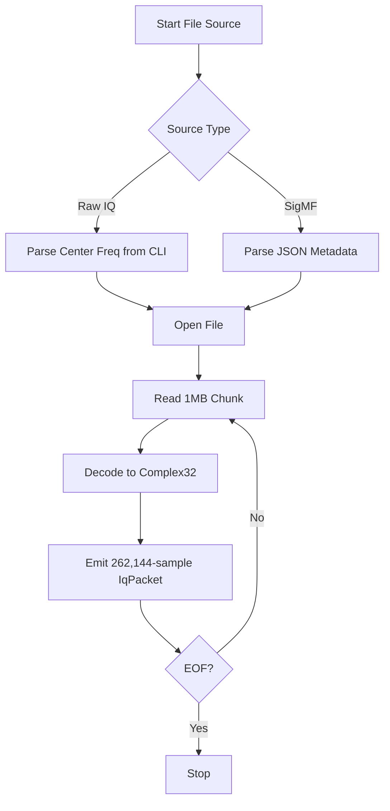

# Design: File-backed SDR Sources (sdr-file-rs)

This document outlines the design of the `sdr-file-rs` crate, which provides file-backed offline playback for the SDR detection applications detection system.

## 1. Introduction

The crate provides two implementations of the `SdrSource` trait: `RawIqFileSource` for headerless binary dumps and `SigmfFileSource` for structured SigMF recordings. The primary design goal is faithful offline reproduction of SDR streams, ensuring the DSP pipeline behaves identically against historical captures as it does against live hardware.

## 2. System Architecture

Unlike hardware SDRs, file sources do not implement channel hopping. The file *is* the capture, played back at its natural rate.

### Data Slicing and Stitching

SDR detection applications worker threads are optimized for batch processing. Both file backends:
- Read raw bytes from disk in large 1 MB chunks for I/O efficiency.
- Decode the specific data type (`i16`, `f32`) into `Complex32` samples.
- Slice the decoded data into consistent 262,144-sample packets, each wrapped in a `PooledIqBuffer` for zero-allocation recycling.
- Maintain a stateful remainder buffer to stitch partial samples across 1 MB read boundaries, ensuring no IQ pair is ever split.

## 3. RawIqFileSource

Headerless recordings have no self-describing metadata.
- **Center Frequency**: Sourced externally (e.g., from a CLI `--center-freq` flag).
- **Data Type Inference**: Determined purely by file extension:
  - `.bin` → Treated as signed 16-bit little-endian (`ci16_le`). Scaled by `1.0 / 32768.0`.
  - `.f32`, `.cf32`, etc. → Treated as IEEE-754 32-bit floats (`cf32_le`). Passed through natively.

## 4. SigmfFileSource

The [Signal Metadata Format (SigMF)](https://github.com/sigmf/sigmf-spec) provides a structured JSON sidecar (`.sigmf-meta`) describing the raw binary payload (`.sigmf-data`).

### Resolution and Parsing
1. **Pair Resolution**: The backend accepts either the `.sigmf-meta` path, the `.sigmf-data` path, or the bare basename, and automatically resolves the sibling file.
2. **JSON Deserialization**: Uses `serde_json` to parse the metadata. Unrecognized namespaces and extension fields are ignored (`serde(default)`), ensuring forward compatibility.
3. **Parameter Extraction**:
   - `global.core:datatype` dictates the decoding path (`cf32_le` or `ci16_le`).
   - `global.core:sample_rate` populates `IqPacket::sample_rate_hz`.
   - `captures[0].core:frequency` populates `IqPacket::center_frequency_hz`.

By relying strictly on the metadata as the source of truth, `SigmfFileSource` safely overrides any contradictory CLI configuration, guaranteeing accurate playback scaling and frequency labels.

### 🏷️ Supported SigMF fields

The parser is `serde(default)` for unknown fields and skips unknown
namespaces, so extension annotations don't break parsing. The fields
the source actually consults:

| JSON path | Used for |
|---|---|
| `global.core:datatype` | datatype dispatch (`cf32_le` / `ci16_le`) |
| `global.core:sample_rate` | `IqPacket::sample_rate_hz` |
| `global.core:version` | parsed, not range-checked |
| `captures[].core:frequency` | `IqPacket::center_frequency_hz` (first capture wins) |
| `captures[].core:sample_start` | parsed (multi-capture support hook; not yet used to split packets) |
| `captures[].core:datetime` | parsed, not consumed |

### 🛠️ Helpers

| Function | Purpose |
|---|---|
| `sigmf::resolve_pair(path) -> (meta, data)` | Resolve a `.sigmf-meta` / `.sigmf-data` / bare-basename input to the pair of paths, erroring if the data sibling is missing. |
| `sigmf::looks_like_sigmf(path) -> bool` | Predicate used by the SDR applications `file` subcommand dispatcher to decide whether to route a path through `SigmfFileSource` instead of `RawIqFileSource`. |
| `SigmfMetadata::load(meta_path)` | Read + parse a `.sigmf-meta` JSON file. |
| `DataType::from_spec(s)` | `cf32_le` / `ci16_le` → enum, anything else → error. |
| `DataType::decode(bytes) -> Vec<Complex32>` | Pure decoder, allocation-per-call (1 MB chunks are decoded into 131 072-sample vectors). |
